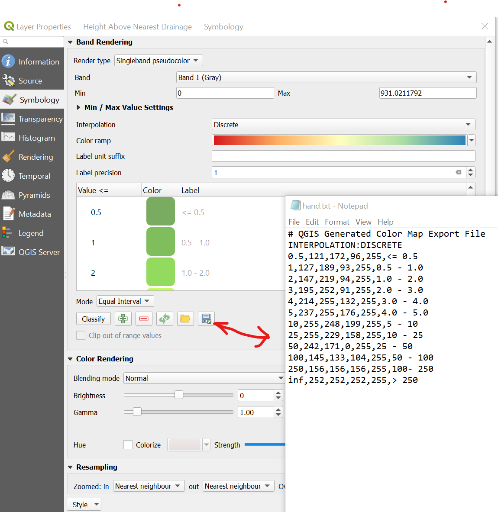
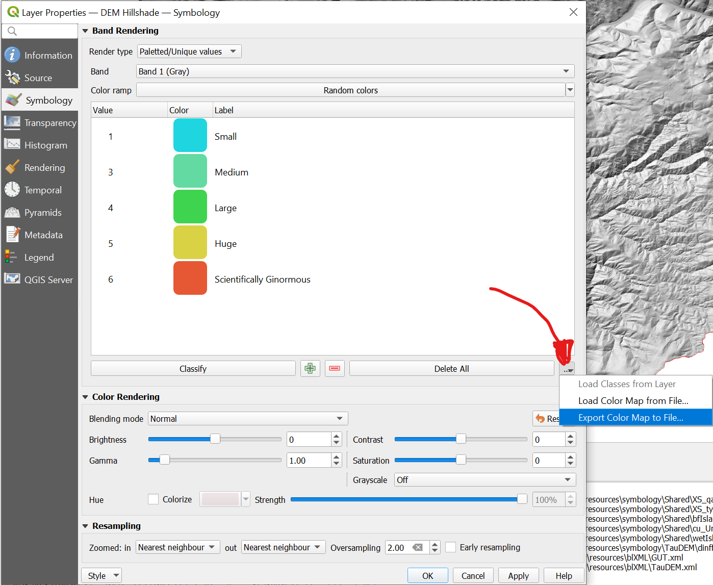

# WebRAVE Raster Symbology files

After a discussion from @joewheaton we decided to simplify the work necessary to bring our QML files from QRave into the web so we can have symbolized rasters in WebRAVE. @lauren-herbine and @shelbysawyer this might apply to you at some point

The raster `.txt` format we are using is based on the `r.colors` spec and we use it when we run [gdalDem](https://gdal.org/programs/gdaldem.html) to "bake-in" the symbology. The spec for this file is compatible with both [`r.colors`](https://grass.osgeo.org/grass82/manuals/r.colors.html) and ESRI HDR color table files (.clr).

So how do we convert our QML raster symbolization to color ramps for the web? It depends on the type of symbology you're using

## File naming

The only trick here is putting it in the right place with the right file name

The filename must be `somename.txt` and the `somename` part should match what's in the symbology attribute in the business logic XML file (this is the same naming convention as the qml files. 

So if my business logic looks like this:

``` xml
 <Node label="Detrended DEM (HAND - Height Above Nearest Drainge)" xpath="Raster[@id='HAND']" type="raster" symbology="hand" transparency="40" />
```

then my file name should be `hand.txt`

## **_CASE MATTERS_**

the `.txt` part should always be lowercase and the case of the filename should match EXACTLY what's in the business logic XML


## Folder naming

These files should live alongside the `.json` files for the webRAVE vectors

``` bash
# so if I want to put in a file shared across all projects then
RiverscapesXML/Symbology/web/Shared/whatever.txt
# otherwise, for project-specific symbologies
RiverscapesXML/Symbology/web/ProjectTypeName/whatever.txt
```

----------------------------------------------------------------------

## Singleband pseudocolor

This is the easiest one. Basically it's just clicking the save button and naming the file.

1. Use QGIS and QRAVE to load up the raster layer you want to symbolize for the web (assuming you already have a `.qml` for this layer of course)
2. Open the symbology menu and click the little save icon. 



That's it. Now just name it and put it in the right folder and push it to git.

Here's an example of the DEM symbolozation

```
# QGIS Generated Color Map Export File
INTERPOLATION:INTERPOLATED
1259.3421630859375,255,235,176,255,1259
1670.69324584960941138,38,115,0,255,1671
2082.04432861328132276,115,77,0,255,2082
2505.860595703125,255,255,255,255,2506
```

The columns are:

Value | Red | Green | Blue | Alpha | Label
-- | -- | -- | -- | -- | --
FLOAT | Int (0-255) | Int (0-255) | Int (0-255) | Int (0-255) | TEXT

So even if the last column looks like a number you can have a text value if you want like so:

```
# QGIS Generated Color Map Export File
INTERPOLATION:INTERPOLATED
1259.3421630859375,255,235,176,255,Small
1670.69324584960941138,38,115,0,255,Medium
2082.04432861328132276,115,77,0,255,Large
2505.860595703125,255,255,255,255,Huge
```

### Example: `dem.txt`

Here's what the `dem.txt` file looks like:

```txt
 # QGIS Generated Color Map Export File
INTERPOLATION:INTERPOLATED
1129.3089599609375,255,235,176,255,1129
1482.00189819335946595,38,115,0,255,1482
1834.6948364257814319,115,77,0,255,1835
2198.075439453125,255,255,255,255,2198
```

Note that even though the values of the raster are exact floats derived from the raster you were symbolizing they will be converted when symbolizing other rasterss. Since this labeled as `INTERPOLATION:INTERPOLATED` the values will be converted to a percent when the tiling happens. For the example above this will be converted into the following object at tile-time:

```json
{
  "gdalDem": "0%,255,235,176,255\n33%,38,115,0,255\n66%,115,77,0,255\n100%,255,255,255,255\nnv,0,0,0,0",
  "legend": [
    ["rgba(255,235,176,255)","0%"],
    ["rgba(38,115,0,255)","33%"],
    ["rgba(115,77,0,255)","66%"],
    ["rgba(255,255,255,255)","100%"]
  ],
  "rampType": "INTERPOLATED"
}
```

The "legend" entry is what the legend inside the web viewer will say and the "gdalDem" entry is what we actually pass to the gdalDem command as a file:

```csv
0%,255,235,176,255
33%,38,115,0,255
66%,115,77,0,255
100%,255,255,255,255
nv,0,0,0,0
```

`nv` means nodata value and we set this automatically to allow transparency in the raster.

----------------------------------------------------------------------

## Palletted, unique colors

1. Use QGIS and QRAVE to load up the raster layer you want to symbolize for the web (assuming you already have a `.qml` for this layer of course)

2. Beside the "Delete All" button there's a little menu button. Click that and choose **"Export Color Map to File"**. 



You will get a `.clr` file that  looks like this:

```
1 31 213 223 255 Small
3 98 218 162 255 Medium
4 62 212 79 255 Large
5 217 210 69 255 Huge
6 230 87 51 255 Scientifically Ginormous
```

Note this isn't comma-separate so we need to convert this format to be like the one for singleband pseudocolor above. Another major difference is that we need to use the `INTERPOLATION:DISCRETE` line. Here's what this file looks like after I convert it:

```
# QGIS Generated Color Map Export File
INTERPOLATION:DISCRETE
1,31,213,223,255,Small
3,98,218,162,255,Medium
4,62,212,79,255,Large
5,217,210,69,255,Huge
6,230,87,51,255,Scientifically,Ginormous
```

again, the the columns are:

Value | Red | Green | Blue | Alpha | Label
-- | -- | -- | -- | -- | --
FLOAT | Int (0-255) | Int (0-255) | Int (0-255) | Int (0-255) | TEXT

----------------------------------------------------------------------